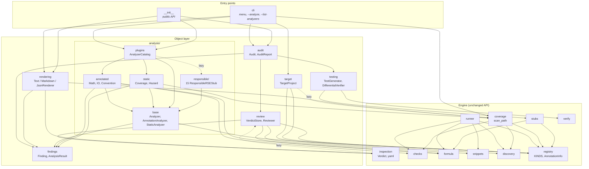
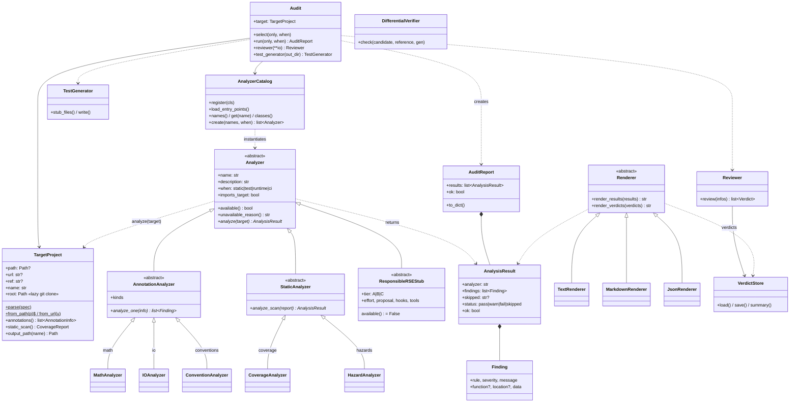
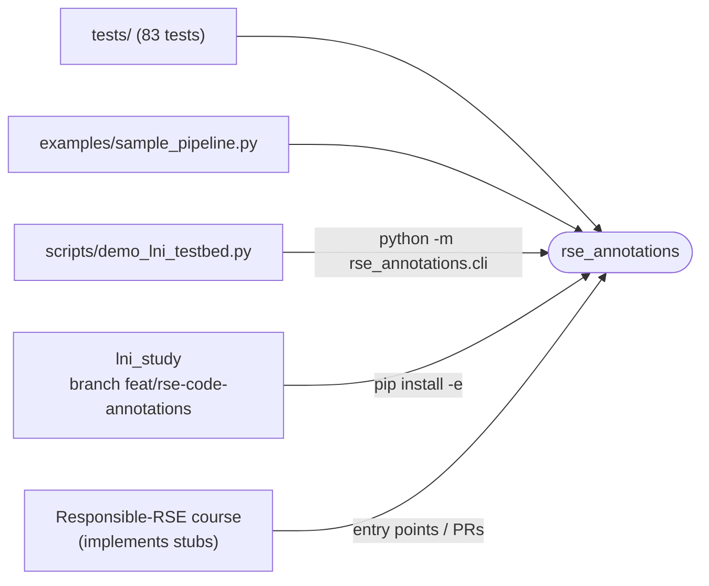

# Architecture

Updated 2026-09-29 for the object-model refactor (branch `refactor/object-model`).
Arrows are taken from the real `import` statements (lazy = imported inside a function).
Mermaid renders on GitHub.

The package has two layers:

- **Object layer (new).** `TargetProject` → `Audit` → `Analyzer` subclasses → `AnalysisResult`,
  plus `Reviewer` (verdicts), `Renderer` (visualisation) and `TestGenerator` (tests).
  This is what the CLI and new code use.
- **Engine (unchanged API).** `discovery`, `checks`, `formula`, `snippets`, `coverage`,
  `inspection`, `stubs`, `verify`, `runner`. The object layer wraps them, so `tests/`,
  `examples/` and the lni_study testbed keep working.

## 1. Module dependencies

`A --> B` means *A imports B*. The graph is acyclic.



Two import cycles are avoided with lazy imports: `inspection.run_inspection` now delegates
to `review.Reviewer`, and `plugins.default_catalog` loads `responsible/` on demand.

## 2. Class hierarchy (the plugin design)

Each analysis idea is a subclass of `Analyzer`. The base class *is* the plugin contract:
third-party packages register subclasses under the entry-point group
`rse_annotations.analyzers`, and `AnalyzerCatalog` finds them next to the built-ins.



The three responsibilities the refactor asked for:

| Responsibility | Class(es) | Wraps (engine) | Output |
|---|---|---|---|
| Analysing code | `Analyzer` subclasses, run by `Audit` | `checks`, `formula`, `coverage` | `AnalysisResult` / `AuditReport` |
| Visualising verdicts | `Reviewer` + `VerdictStore`; `Renderer` subclasses | `inspection` | `inspection.yaml`, text / markdown / JSON |
| Generating tests | `TestGenerator`, `DifferentialVerifier` | `stubs`, `verify` | `tests/test_*.py`, `DiffResult` |

`Audit.run()` never crashes on one analyzer:

- an unavailable analyzer (a missing optional dependency, or a stub) is reported as **skipped** with its reason;
- an exception is turned into a **fail** finding (`analyzer_error`).

## 3. Writing a plugin

```python
from rse_annotations import StaticAnalyzer, Finding

class TodoCounter(StaticAnalyzer):
    name = "todo_count"
    description = "counts unannotated candidate functions"
    when = "static"

    def analyze_scan(self, report):
        n = sum(1 for r in report.records if r.eligible and not r.kind)
        return self.result([Finding("unannotated", "info", f"{n} candidates")])
```

Register it in the plugin package's `pyproject.toml`:

```toml
[project.entry-points."rse_annotations.analyzers"]
todo_count = "my_pkg.checks:TodoCounter"
```

Then run it with `python -m rse_annotations.cli src --analyze --only todo_count`. To check that it is found, use `--list-analyzers`.

## 4. Responsible-RSE stubs (course tasks)

`analysis/responsible/` holds 15 stubs from `RESPONSIBLE_RSE_PLUGINS.md`. They are listed by
`--list-analyzers` and are *skipped* in every audit until implemented. Each docstring is the
task spec ("TODO (Tier X, effort)"), and `_stub.py` explains how to turn one into a working analyzer.

| Module (question) | Analyzer `name` | Tier | when |
|---|---|---|---|
| `reuse` — can others legally reuse it? | `licence`, `data_terms` | A | static |
| | `archival` | C | static |
| `integrity` — are the results trustworthy? | `silent_failures`, `constants`, `llm_disclosure` | A | static |
| | `leakage` | B | static |
| | `inference_ledger` | B | runtime |
| `safety` — can it harm? | `security` | A | static |
| | `purpose_retention` | B | static |
| | `dual_use` | C | static |
| `inclusion` — is it inclusive and sustainable? | `fairness` | B | test |
| | `figure_accessibility` | B | static |
| | `footprint` | B | runtime |
| | `inclusive_language` | C | static |

Tier A = a static check doable in one session; B = needs runtime hooks or a library; C = research-grade.

**Open:** analyse [EVERSE RSQKit](https://everse.software/RSQKit/) for ideas and existing work
to map onto these stubs (see `REFACTOR_NEXT_STEPS.md`).

## 5. Engine data classes (unchanged)

| Module | Produces | Persisted as |
|---|---|---|
| `inspection` | `Verdict` | `inspection.yaml` |
| `stubs` | `StubFile` | `test_*.py` stubs that `skip()` until filled in |
| `coverage` | `CoverageReport` → `FunctionRecord` → `Hazard` | `annotation_coverage.md` |
| `runner` | `Report` (legacy batch path, superseded by `Audit`) | text / JSON |
| `verify` | `DiffResult` | — (in memory, for tests) |

Only the standard library is required (`dependencies = []`). SymPy and latexify are loaded lazily inside `formula`.

## 6. Consumers (outside the package)


