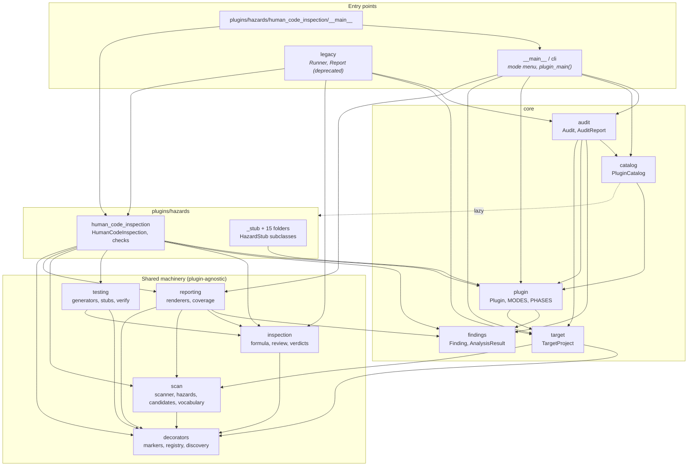
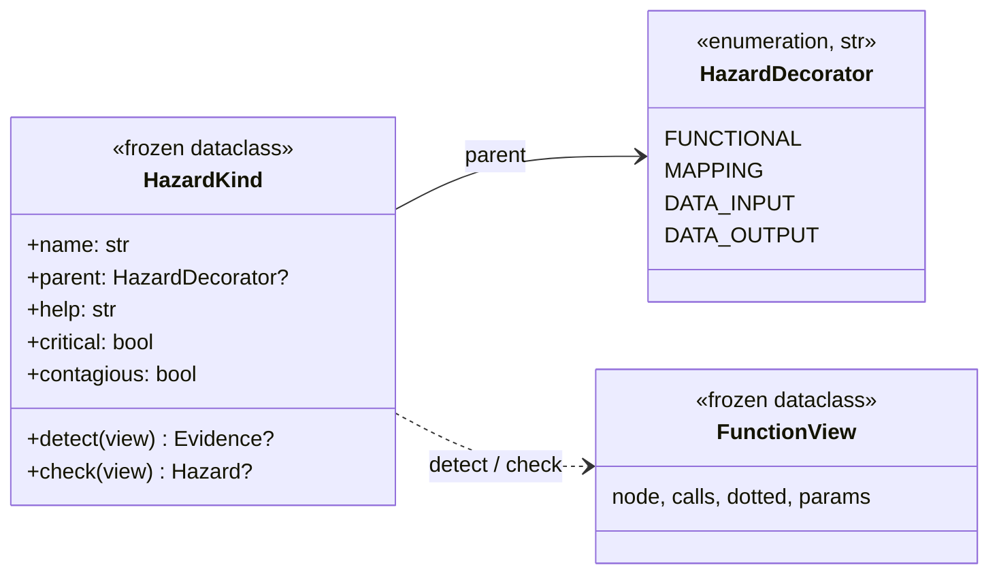
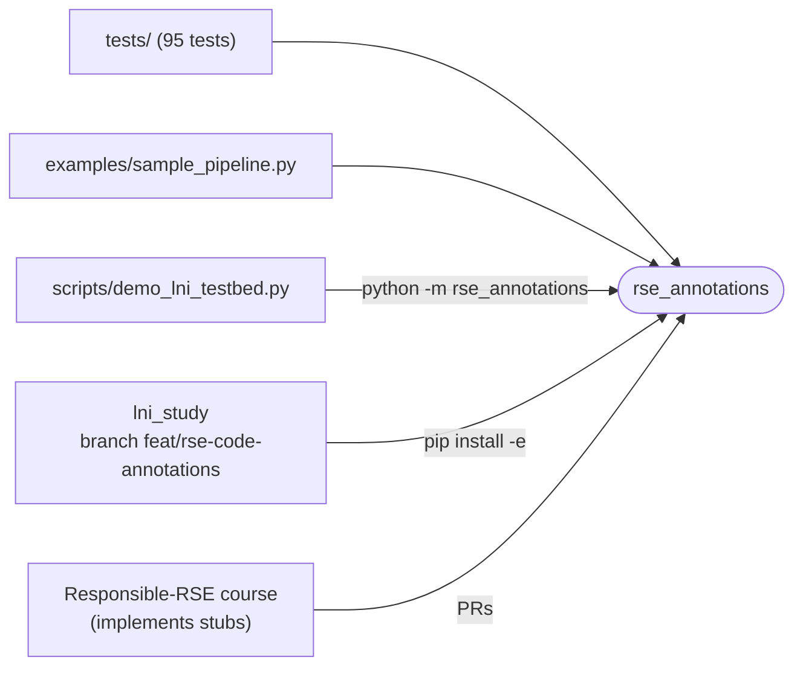

# Architecture

Updated 2026-09-30 for the plugin restructure and the decorator/hazard refactor (branch `refactor/object-model`, v0.2.0).
Arrows come from the real `import` statements. Mermaid renders on GitHub.

The idea in one sentence: **producers mark their research code** (with decorators)
**so that hazard plugins can check it**. The human inspection of generated code is one
such plugin (`human_code_inspection`), on the same level as the Responsible-RSE hazards.

```
rse_annotations/
├── decorators/      the marks: markers (decorators + HazardDecorator enum), registry, discovery
├── scan/            static AST scan, never imports: model, scanner, candidates, hazards
│                    (HazardKind, HAZARD_KINDS), vocabulary (data only), ast_utils
├── inspection/      the active human review: formula inference, snippets, verdicts, review
├── testing/         test scaffolds and differential verification: generators, stubs, verify
├── reporting/       every renderer: text / markdown / json, coverage report
├── core/            TargetProject, Plugin contract, Finding/AnalysisResult, PluginCatalog, Audit
├── plugins/
│   └── hazards/
│       ├── human_code_inspection/   the worked example: plugin.py, checks.py, __main__.py
│       ├── _stub.py                 HazardStub (base for the course tasks)
│       └── licence/ … footprint/    15 Responsible-RSE stubs, one folder each
├── cli.py           the general entry point + plugin_main() for per-plugin entry points
├── __main__.py      python -m rse_annotations
└── legacy.py        deprecated Runner / Report (per-function view)
```

**Rule of thumb.** A *plugin* answers one hazard question and is one class. Everything
several plugins could reuse (AST analysis, the decorator scanner, the review loop, test
generation, rendering) lives in its own top-level folder and knows nothing about plugins.

## 1. Module dependencies

`A --> B` means *A imports B*; dashed = imported lazily inside a function. The graph is acyclic
(`core.plugin` imports `core.target` only for type hints).



The shared machinery never imports `core` or `plugins` (except `reporting`, which only needs
the `Finding` data class). That is what makes it reusable by any plugin.

## 2. Decorators and hazards: two axes

A function carries **one decorator** (what it *is*, declared by the producer) and **any number
of hazards** (what can go wrong in it, found by the scan). The two are independent:
`compute_dimension_icr` is `@mapping` *and* `statistical`.



- **`HazardDecorator`** (`decorators/markers.py`) is a `str`-Enum, so `"functional"` is written
  once; text only appears at the edges (AST names, YAML, JSON). A test keeps it in sync with
  `DECORATORS`, the list of decorator functions.
- **`HazardKind`** (`scan/hazards.py`) bundles one hazard: its name, help text, flags and its
  detector function (Strategy pattern). `HAZARD_KINDS` is the single source; `HAZARDS`,
  `HAZARD_PARENT`, `HAZARD_HELP`, `CRITICAL_HAZARDS` are derived from it. New hazard = one
  detector + one entry.
- **`parent` is composition, not inheritance.** It names the decorator a hazard typically
  refines and is used for display only; it never constrains which decorator a function carries.
- **`scan/vocabulary.py`** holds the evidence tokens (`openai`, `shuffle`,
  `cohen_kappa_score`, ...) as plain data. Teaching the scan a new library means extending a
  list; the detectors stay unchanged.

## 3. The plugin contract

A plugin is **one class**, a subclass of `core.plugin.Plugin`. It offers a *mode* by
overriding the matching method; `Plugin.modes()` reports which it overrides.

| Mode (`MODES`) | Method | Menu label |
|---|---|---|
| `inspect` | `inspect(target, *, input_fn, output_fn)` | Human inspection |
| `analyze` | `analyze(target) -> AnalysisResult` | Hazard analysis |
| `generate_tests` | `generate_tests(target, *, output_fn)` | Test generation |

```mermaid
classDiagram
    direction TB
    class Plugin {
        +name, description, question
        +when: static|test|runtime|ci
        +imports_target: bool
        +modes()$ tuple
        +supports(mode)$ bool
        +available() / unavailable_reason()
        +inspect(target)
        +analyze(target) AnalysisResult
        +generate_tests(target)
        +result(findings, data, skipped)
    }
    class HumanCodeInspection {
        +facets: coverage, hazards, uninspected, conventions, math, io
        +fixtures
    }
    class HazardStub {
        +tier: A|B|C
        +difficulty: 1..5
        +proposal, effort, hooks
        +available() False
    }
    Plugin <|-- HumanCodeInspection : all three modes
    Plugin <|-- HazardStub : analyze only
    HazardStub <|-- Licence
    HazardStub <|-- ComputeFootprint
    HazardStub <|-- "… 13 more"

    class PluginCatalog {
        +register(cls)
        +load_entry_points()
        +get(name) / names() / classes()
        +for_mode(mode) list
        +create(names, when, mode) list~Plugin~
    }
    class Audit {
        +target: TargetProject
        +select(only, when, mode)
        +plugin(name) Plugin
        +run(only, when) AuditReport
        +run_one(plugin) AnalysisResult
    }
    class TargetProject {
        +parse(spec) / from_path / from_url / from_modules
        +root, name
        +decorated() list~DecoratorInfo~
        +static_scan() CoverageReport
    }
    class AnalysisResult {
        +plugin: str
        +findings: list~Finding~
        +data (plugin-native payload)
        +skipped: str?
        +status / ok
    }
    Audit --> TargetProject
    Audit --> PluginCatalog
    PluginCatalog ..> Plugin : instantiates
    Plugin ..> AnalysisResult : analyze()
```

Design decisions:

- **No abstract `StaticHazard` layer.** An intermediate base class is worth it once a second
  implementation shares its logic; until then a plugin calls `target.static_scan()` itself.
- **Decorator coverage is not a hazard.** It is a *facet* of `human_code_inspection` (and the
  scan it needs lives in `scan/`, so other hazards can use it too). The per-plugin entry point
  offers the coverage report as an extra action.
- **`Audit.run()` never crashes on one plugin.** An unavailable plugin (stub, missing dependency)
  is reported as *skipped* with its reason; an exception becomes a `plugin_error` *fail* finding.
- **External plugins** register a `Plugin` subclass under the entry-point group
  `rse_annotations.plugins`; the catalog loads them next to the built-ins.

## 4. Two entry points

**General** — `python -m rse_annotations [path|git-url]`. Choose a mode; the CLI delegates:

- *Hazard analysis* runs every plugin (or `--only a,b`), renders text / markdown / json and
  exits 1 on a `fail` (a CI gate).
- *Human inspection* and *Test generation* use the one plugin that offers the mode, or ask
  which one if several do (`--plugin NAME` picks directly).

Flags skip the menu: `--inspect`, `--analyze`, `--tests` (alias `--stubs`), `--coverage`, `--list`.

**Per plugin** — `python -m rse_annotations.plugins.hazards.<name> [path]`. The plugin's
`__main__.py` is three lines around `cli.plugin_main(...)`: the menu lists only that plugin's
modes plus its `extra_actions` (for `human_code_inspection`: the coverage report).

## 5. Writing a plugin

```python
from rse_annotations import Finding, Plugin

class TodoCounter(Plugin):
    name = "todo_count"
    description = "counts undecorated candidate functions"

    def analyze(self, target):
        report = target.static_scan()          # shared scan, never imports the code
        n = len(report.candidates)
        return self.result([Finding("undecorated", "info", f"{n} candidates")])
```

Plugins are committed to this project: put the class in `rse_annotations/plugins/hazards/<name>/`
and add it to the tuple in `plugins/hazards/__init__.py`. `python -m rse_annotations --list` then
shows it; `python -m rse_annotations src --analyze --only todo_count` runs it.

## 6. Responsible-RSE stubs (course tasks)

`plugins/hazards/<name>/` holds 15 stubs from `RESPONSIBLE_RSE_PLUGINS.md`. They are listed by
`--list` and *skipped* in every analysis until implemented. Each docstring is the task spec; `_stub.py`
explains how to turn one into a working plugin.

| Question | Plugin `name` | Tier | when | Difficulty |
|---|---|---|---|---|
| can others legally reuse it? | `licence`, `data_terms` | A | static | 3, 3 |
| | `archival` | C | static | 3 |
| are the results trustworthy? | `silent_failures`, `constants`, `llm_disclosure` | A | static | 2, 2, 2 |
| | `leakage` | B | static | 4 |
| | `inference_ledger` | B | runtime | 5 |
| can it harm? | `security` | A | static | 2 |
| | `purpose_retention` | B | static | 3 |
| | `dual_use` | C | static | 2 |
| is it inclusive and sustainable? | `fairness` | B | test | 3 |
| | `figure_accessibility` | B | static | 3 |
| | `footprint` | B | runtime | 2 |
| | `inclusive_language` | C | static | 1 |

Tier A = a static check doable in one session; B = needs runtime hooks or a library; C = research-grade.
**Difficulty** is the expected student workload over a semester, 1 = about 1 h/week … 5 = about 5 h/week.
Runtime hazards (`footprint`, `inference_ledger`) follow `RUNTIME_HAZARDS.md`.

`EVERSE_MAPPING.md` maps EVERSE dimensions, RSQKit tasks and tools onto these plugins
(its class names still use the old `…Analyzer` suffix).

## 7. Consumers (outside the package)


